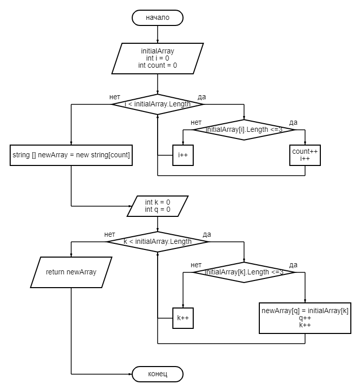
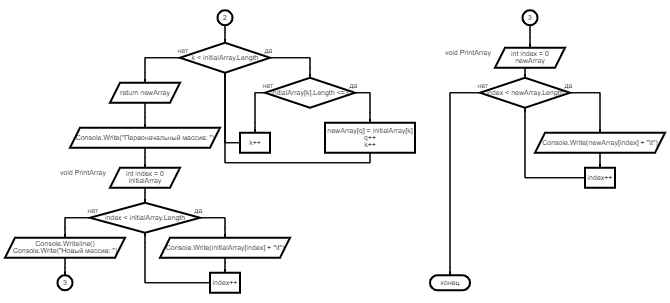

# Итоговая контрольная работа по основному блоку
## Кохан Тамара
### Задача:
Написать программу, которая из имеющегося массива строк формирует новый массив из строк, длина которых меньше, либо равна 3 символам. Первоначальный массив можно ввести с клавиатуры, либо задать на старте выполнения алгоритма. При решении не рекомендуется пользоваться коллекциями, лучше обойтись исключительно массивами.
### Описание решения задачи:
1. Создание первоначального массива\
Создаем массив ***initialArray***. Массив будет состоять из строк, поэтому тип данных массива - ***string***. Массив создается и заполняется с помощью метода ***CreateArray***. При этом размер массива задается пользователем с клавиатуры с помощью метода ***Input***. Данные массива также задаются пользователем с помощью метода ***InputString***.
2. Описание основного блока программы\
Основной блок программы записан в методе ***NewArray***. Метод принимает массив ***array*** и возвращает массив ***newArray***.\
Так как в новом массиве должны быть строки, длина которых меньше, либо равна 3 символам, то длина нового массива будет равна количеству подходящих 
под это условие строк.\
Создаем переменную ***i*** равную 0, которая будет обозначать индекс элемента массива ***array***, и переменную ***count*** равную 0, которая является счетчиком нужных нам строк.\
Входим в цикл ***while***, условием которого являеется выражение ***i < array.Length*** (т.е. пока индекс элемента меньше длины массива, цикл будет работать). Если условие верно, то проверяем, подходит ли элемент массива под условие ***array[i].Length <= 3*** (длина элемента массива с индексом ***i*** меньше, либо равна 3). Если и это условие верно, то увеличиваем счетчик ***count*** на 1 и индекс ***i*** также увеличиваем на 1. Если данное условие не верно, то увеличиваем на 1 только индекс ***i***.\
Затем возвращаемся в начало цикла, и так до тех пор, пока условие в цикле (***i < array.Length***) верно. Как только это условие перестает быть верным, выходим из цикла.\
В итоге в переменной ***count*** будет хранится количество строк, длина которых 
меньше, либо равна 3.\
Создаем новый массив ***newArray***. Так как данные массива будут строками, то тип данных массива будет ***string***. Длинной массива ***newArray*** будет значение переменной ***count***.\
Теперь будем заполнять массив ***newArray***. Для этого создаем переменную ***k*** равную 0, 
которая будет обозначать индекс элемента массива ***array***, и переменную ***q*** равную 0, которая будет обозначать индекс элемента массива ***newArray***.\
Входим в цикл ***while***, условием которого являеется выражение ***k < array.Length*** (т.е. пока индекс элемента меньше длины массива ***array***, цикл будет работать). Если условие верно, то проверяем, подходит ли элемент массива 
под условие ***array[k].Length <= 3*** (длина элемента массива с индексом ***k*** меньше, 
либо равна 3). Если и это условие верно, то записываем этот элемент в массив ***newArray*** в значение c индексом ***q*** (***newArray[q] = array[k]***), затем увеличиваем индекс ***q*** на 1 и индекс ***k*** так же на 1. Если это условие не верно (длина строки больше 3), то увеличиваем индекс ***k*** на 1.\
Затем возвращаемся в начало цикла, и так до тех пор, пока условие в цикле (***k < array.Length***) верно. Как только это условие перестает быть верным, выходим из цикла.\
В итоге массив ***newArray*** заполнится строками, длина которых меньше, либо равна 3.\
Блок-схема к основному блоку программы:\

3. Вывод массивов на экран\
Для вывода массивов на экран воспользуемся методом ***PrintArray***. Сначала выводим массив ***initialArray***, затем переходим на новую строку и выводим новый массив через метод ***NewArray***, который принимает первоначальный массив ***initialArray*** (***PrintArray(NewArray(initialArray))***). Оформляем вывод массивов описанием.\
4. Программа завершена.\
Блок-схема:\

### Описание методов:
- **Метод** ***Input***\
Имеет тип данных ***int***, что означает, что он возвращает число. Принимает строку, которую увидит пользователь на экране (приглашение для ввода данных).\
Конвертирует строку, введенную пользователем, в число и возвращает его.

- **Метод** ***InputString***\
Имеет тип данных ***string***, что означает, что он возвращает строку. Принимает строку, которую увидит пользователь на экране (приглашение для ввода данных).\
Возвращает строку, введеную пользователем.

- **Метод** ***CreateArray***\
Метод для создания массива и заполнения его данными, которые задает пользователь с клавиатуры. Имеет тип данных ***string[]***, что означает, что он возвращает массив строк. Ничего не принимает.\
Создаем массив ***array***. Массив будет состоять из строк, поэтому тип данных массива - ***string***. Размер массива задается пользователем с клавиатуры. Для этого используем метод ***Input*** (*смотри описание выше*).\
Далее заполняем массив. Создаем переменную ***index*** равную 0, которая будет обозначать индекс элемента массива. Входим в цикл ***while***, условием которого являеется выражение ***index < array.Length*** (т.е. пока индекс элемента меньше длины массива ***array***, 
цикл будет работать). Если условие верно, то с помощью функции ***InputString*** (*смотри описание выше*) записываем введенное пользователем значение в массив в элемент с индексом ***index*** (***array[index] = InputString("Введите элемент массива: ")***) и увеличиваем индекс ***index*** на 1. Затем возвращаемся в начало цикла, и так до тех 
пор, пока условие в цикле (***index < array.Length***) верно. Как только это условие 
перестает быть верным, выходим из цикла.\
Массив заполнен.

- **Метод** ***NewArray***\
Метод для основного решения задачи - создания нового массива. Имеет тип данных ***string[]***, что означает, что он возвращает массив строк. Принимает массив ***array*** с типом данных ***string***.\
Описание смотри в п.2 "Описание основного блока программы".

- **Метод** ***PrintArray***\
Метод для вывода массива на экран. Имеет тип данных ***void***. Принимает массив ***array*** с типом данных ***string***. Ничего не возвращает.\
Создаем переменную ***index*** равную 0, которая будет обозначать индекс элемента массива. Входим в цикл ***while***, условием которого являеется выражение ***index < array.Length*** (т.е. пока индекс элемента меньше длины массива ***array***, 
цикл будет работать). Если условие верно, то выводим элемент массива с индексом 
***index*** на экран, добавляя к нему символ табуляции (***Console.Write(array[index] + 
"\t")***), и увеличиваем индекс ***index*** на 1. Затем возвращаемся в начало цикла, и так до тех пор, пока условие в цикле (***index < array.Length***) верно. Как только это условие перестает быть верным, выходим из цикла.\
Массив выведен на экран.
